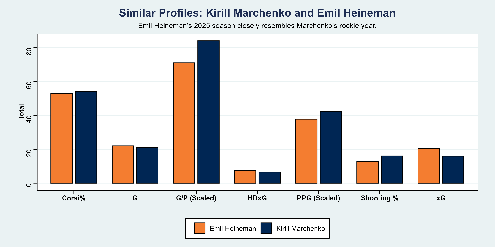

# nhl-breakout-prediction

📖 Read the Report: [PDF](https://jacobrasmussen06.github.io/nhl-breakout-prediction/report/report.pdf) &nbsp; [HTML](https://jacobrasmussen06.github.io/nhl-breakout-prediction/report/report.html)

📃 Medium Article (coming very soon)

🎥 YouTube Video (coming soon)

## Predicting NHL Breakout Forwards Using Machine Learning Techniques and Advanced Hockey Analytics.

Each year in the National Hockey League (NHL), there are players denoted as "breakout players", players whose stat line increases dramatically from one season to the next. Some breakouts are anticipated, while others are more difficult to identify. This project develops two machine learning models that assign probability of breakout to NHL forwards, attempting to predict breakout forwards using player performance and analytics from NHL seasons. 

Two XGBoost models were trained and they balance different objectives:
- Precision Model: highly precise at the top level of players, accurately assigning high probability to a majority of its top 10 and 20.
- Coverage Model: casts a far wider net, more accurate at the top 50 level while sacrificing some precision at the top 10 level.

## Project Highlights

- Sports analytics
- Machine Learning
- Several engineered features
- 40+ custom visualizations created with ggplot2 and with photo editing software
- 10,000 word technical report, medium article (coming soon), and an accompanying YouTube video (coming soon)

## Structure
```text
code/          Data cleaning, feature engineering, model training

data/          Raw and processed datasets

figures/       Figures used in the report

report/        Report and rendered outputs
```

## Key Features

- Trained two XGBoost classification models
- Engineered several predictive features from existing data of NHL performance
- A custom definition of an NHL "breakout"
- Historical analysis featuring six case studies from NHL breakouts from the past five seasons
- Breakout predictions for the 2026-27 NHL season generated with the model using current NHL season data
- Interactive report

## Results

This project evaluates both created models using Precision@K (or Top-K Precision) and Area Under the ROC Curve (AUC). The final models successfully and meaningfully identify breakout players, with one model targeting precision, and the other coverage, and the models were applied to produce predictions for the upcoming NHL season.

## Example Visualizations

The project has over 40 custom visualizations that aid in telling the story of some players, help analyze the model predictions, and help interpret the model. Below are a few examples:


Each player who was directly mentioned in this project and given analysis for had a probability card made for them. This card detailed their current statline, their breakout statline (if applicable), as well as their probability for breakout, and was beautified and personalized to the player.


The above plot shows the probability distribution of the player breakout probabilities, which was used to analyze how well the model did at assigning probabilities to players. 



The above plot shows one of the highest rated predictions for the upcoming NHL seasons, Emil Heineman, compared to an existing star, Kirill Marchenko, highlighting the similarities and why this may indicate a breakout for Heineman.

## Data

The data used in this project were obtained from MoneyPuck.com, an independent hockey analytics website created by Peter Tanner. MoneyPuck provides NHL statistics from the 08-09 season to the current season publicly, including the traditional metrics such as goals and points but also advanced statistics such as Expected Goals (xG), specific data on shots such as their danger level (high, medium, low), possession metrics such as Corsi and Fenwick, and much more.

Player-level data for all NHL skaters were downloaded from MoneyPuck.com's publicly available datasets and used to construct the models. These data served as a foundation for the project's model development and feature engineering. This project is independent and not affiliated with MoneyPuck.com

## Technologies

This project was developed using R and the tidymodels ecosystem. Major packages that were used throughout the project include:

- R
- tidyverse
- xgboost
- ggplot2
- pROC
- ggthemes
- Quarto
- Git

## Reproducibility

1. Clone the repository.
2. Install required packages in R.
3. Run the scripts from the 'code/' directory.
4. Render the report from the 'reports/' directory.

## Future Work

There are several potential avenues for future work in regards to expansion and improvement of this project. Expanding this project could mean predicting NHL breakout defensemen or goaltenders using the same machine learning principles, while improvement may include incorporating shot and tracking data, eveluating additional machine learning models, and exploring SHAP values for model interpretation.

## About Me

Name: Jacob Rasmussen
School: Third year at University of Wisconsin - Madison.
